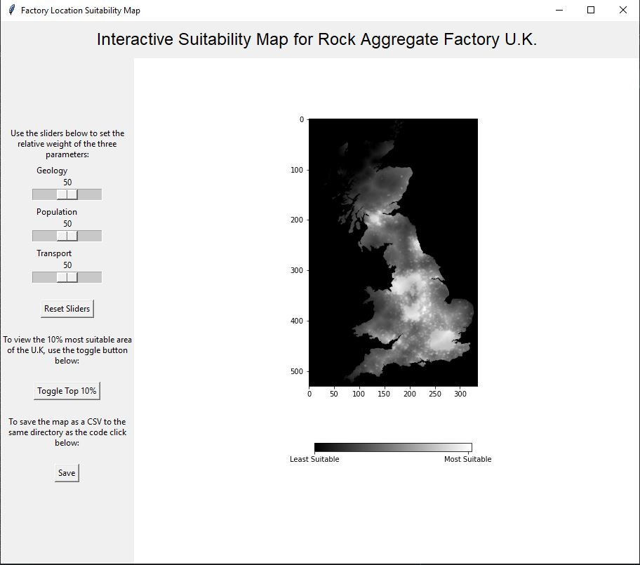

## Project Intention
The aim of this project was to create an interactive map which highlights the most suitable areas of the U.K. to build a new rock aggregate factory, according to the user defined weight of the contributing factors.

## Method
Maps of geology, proximity to motorways and population density were considered as factors contributing to the best placement of a rock aggregate factory. 
The values of these ranged between 0-255, and 255 was intended to be most suitable. Upon examination, the maps of geology and transport seemed to have low values associated with the areas furthest from motorways and areas where current rock aggregate factories exist. These areas were assumed to be desirable, so the polarity of the geology and transport maps was reversed and re-scaled to 0-255. 

The code is split into two classes. The first is named arrayMap(), and includes the importing, reversing polarity, weighting, overlaying and masking of the contributing maps. It heavily utilises the Numpy library to perform array arithmetic. This class is imported and utilised in the second defined class, GUI(), where the Matplotlib and Tkinter libraries are used to produce a user interface which displays the arrays produced by arrayMap() with widgets to allow the user to control the relative weights of the three factors, toggle the top 10% area on and off, and save the suitability map for the whole of the U.K as a CSV. 

## Code 
To run the code download [app.py](app.py) as well as the three contributing maps ([geology](geology.txt), [population](population.txt), and [transport](transport.txt)), open in Spyder and run. The Tkinter window should open and look like: 

 

The PyDoc documentation can be found by downloading [app.html](app.html) and opening in your browser.

## Testing

All tests found that the code runs as intended and all features appear to be fully functional. The majority of the testing has been done within the source code and has been commented out. The tests consist of outputting results to the console and checking their validity. These tests can be commented out and will print results to the console when the code is run.  
Many of the functions created build on other attributes within the classes and thus cannot be simply validated using Doctests. One doctest has been carried out on the 'scaling' function within the arrayMap() class, which passes. 

## Sources 

- [Tkinter documentation](https://tkdocs.com/)
- [Numpy documentation](https://www.google.com/search?q=numpy+documentation&rlz=1C1CHBF_en-GBGB858GB858&oq=numpy+docu&aqs=chrome.0.0i512l2j69i57j0i512l4j69i60.2665j0j4&sourceid=chrome&ie=UTF-8)
- [Matplotlib documentation](https://matplotlib.org/stable/tutorials/index.html)
- [Embedding Matplotlib in Tkinter](https://matplotlib.org/3.1.0/gallery/user_interfaces/embedding_in_tk_sgskip.html)

[MIT License](LICENSE)

